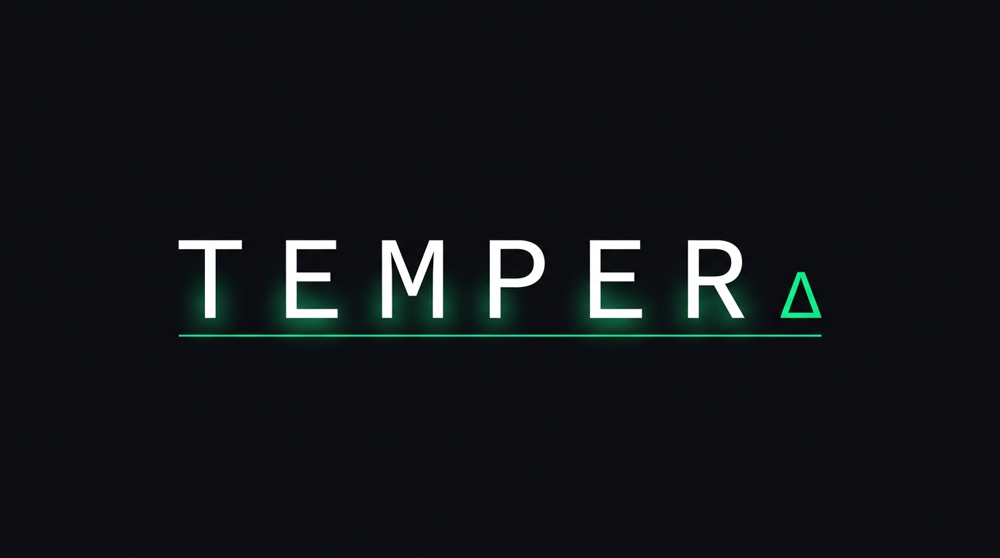

# TEMPER

<p align="center">
  
</p>

> "Model cards test the model — TEMPER tests everything around it, and fixes what it finds."

Environment-level evaluation and auto-remediation for AI deployments. Built for the **AI Engineer World's Fair Hackathon 2026** — Best Usage of Gemini track.

---

## What It Does

TEMPER evaluates the **harness** wrapped around a model — the system prompt, skill files, and tool definitions — not the model itself. It identifies where that environment is helping or hurting performance, generates targeted fixes using Gemini, confirms the fixes work, and honestly flags what it cannot fix.

The key output is the **delta column**: harness score minus bare-model baseline on identical questions. A negative delta on Tool Call Accuracy means your harness is actively degrading a capability the model natively has.

---

## Architecture

There are two ways to run an evaluation:

### Path 1 — Local (`@eval` / `@patch` via Python scripts)

```
local/eval.py                    cloud/ (FastAPI + Gemini)
─────────────────────            ────────────────────────────────────
bundle collector             →   POST /register
test loop (DeepSeek)         ←   GET /next-question
submit answers               →   POST /submit-answer
                                 Gemini judges all answer pairs
render report                ←   GET /results → report + patches

local/patch.py
apply patches                →   POST /reeval
re-eval loop                 ←   GET /next-question (patched dims)
render diff                  ←   GET /results → updated scores
```

### Path 2 — Pi harness (`/patch` command via Pi extension)

```
Pi coding agent                  cloud/ (FastAPI + Gemini)
─────────────────────            ────────────────────────────────────
Dashboard → Create Room      →   POST /rooms/create
Pi: temper_register          →   POST /register (room_id + token)
Pi: temper_next_question     ←   GET /next-question
Pi answers with capabilities →
Pi: temper_submit_answer     →   POST /submit-answer
Live scores                  ←   GET /rooms/{id}/stream (SSE)

Pi: /patch command
fetch results                ←   GET /results
apply patches to bundle
Pi: temper_reeval            →   POST /reeval
Pi: eval loop again          ←   GET /next-question (patched dims)
```

**Model roles:**

| Role | Model |
|---|---|
| Test-taker — local path | DeepSeek, called through the harness by `local/harness.py` |
| Test-taker — Pi path | The Pi agent itself, answering with its own capabilities |
| Baseline | DeepSeek, called bare by the cloud server (no harness) |
| Judge + question generator | Gemini 3.5 Flash |
| Patch generator | Gemini 3.5 Flash |

---

## Quick Start

### 1. Install

```bash
make install-local    # local layer (.venv in local/)
make install-cloud    # cloud layer (.venv in cloud/)
make install-ui       # dashboard UI (npm install)
make build-ui         # build dashboard static files
```

### 2. Configure

Edit `.env` in the project root:

```bash
DEEPSEEK_API_KEY=sk-...
GEMINI_API_KEY=...
ANTIGRAVITY_BASE_URL=http://localhost:8001   # or the deployed DO URL
```

### 3. Run (offline — no API keys required)

```bash
# Terminal 1
make run-mock            # mock server on port 8000

# Terminal 2
make test-local          # full @eval → @patch against mock
make demo                # render pre-cached reports (no server needed)
```

### 4. Run (live — requires API keys)

```bash
# Terminal 1
make run-cloud           # cloud server on port 8001

# Terminal 2
make test-cloud          # full @eval → @patch with live Gemini + DeepSeek
```

### 5. Run via Pi harness

```bash
# Terminal 1
make run-cloud           # cloud server on port 8001

# Browser
open http://localhost:8001   # dashboard → Create Room → copy connection block

# Pi session
# paste the connection block → Pi registers, answers questions, streams live scores
# after eval completes:
/patch                   # Pi fetches patches, applies them, runs re-eval automatically
```

---

## Make Commands

| Command | What it does |
|---|---|
| `make install-local` | Install local layer dependencies |
| `make install-cloud` | Install cloud layer dependencies |
| `make install-ui` | Install dashboard UI npm dependencies |
| `make build-ui` | Build dashboard static files into `extension/ui/dist/` |
| `make run-mock` | Start scripted mock server on port 8000 |
| `make run-cloud` | Start live cloud server on port 8001 (requires API keys) |
| `make run-cloud-offline` | Start cloud server in offline/scripted mode on port 8001 |
| `make test-local` | Full @eval → @patch against mock server (no API keys) |
| `make test-cloud` | Full @eval → @patch against live cloud server |
| `make test-integration` | Integration test asserting villain-env score bands (offline, deterministic) |
| `make demo` | Render pre-cached eval + diff reports (no server needed) |
| `make validate-schemas` | Validate fixtures against JSON schemas |

---

## The Demo Path (3 minutes)

Pre-cached reports render instantly.

```bash
# No server needed — reads from local/demo_cache/
make demo
```

Or the full live flow (local path):
```bash
# Terminal 1: make run-cloud
# Terminal 2:
cd local
TEMPER_OFFLINE=false ANTIGRAVITY_BASE_URL=http://localhost:8001 python eval.py
TEMPER_OFFLINE=false ANTIGRAVITY_BASE_URL=http://localhost:8001 python patch.py
```

**Demo numbers (villain environment):**

| Dimension | Baseline | Harness | Δ | Status |
|---|---|---|---|---|
| instruction_adherence | 71 | 44 | −27 | NEEDS_PATCH |
| tool_accuracy | 72 | 31 | −41 | NEEDS_PATCH |
| output_format | 88 | 85 | −3 | PASSING |
| skill_trigger | 60 | 52 | −8 | NEEDS_PATCH |
| latency_delta | 90 | 74 | −16 | NEEDS_PATCH |
| error_recovery | 38 | 35 | −3 | STRUCTURAL_LIMITATION |

Post-patch: tool_accuracy 31→79 RESOLVED, instruction_adherence 44→82 RESOLVED.

---

## Repo Layout

```
local/
  eval.py              @eval entry point (bundle collect + test loop + results poll)
  patch.py             @patch entry point (apply patches + reeval loop)
  bundle.py            env dir → validated bundle
  harness.py           DeepSeek inference (measures latency_ms)
  client.py            HTTP client for all endpoints (retry/backoff logic)
  renderer.py          rich terminal report renderer
  demo.py              pre-cached demo player
  demo_cache/          pre-serialised eval + reeval reports
  test_integration.py  integration test (villain env score bands)

cloud/
  main.py          FastAPI app — all endpoints (local + Pi room paths)
  session.py       session + room store and state machine
  generator.py     Gemini question generation
  baseline.py      bare DeepSeek baseline runner (batch + per-question)
  judge.py         Gemini-as-judge scoring
  bench.py         coding benchmark question bank + test executor
  patcher.py       Gemini patch artifact generation
  config.py        shared env vars

extension/
  temper.ts        Pi coding agent extension
  skills/
    temper_protocol.md   injected skill: TEMPER eval + /patch protocol
  ui/              React dashboard (served statically by cloud server)
    src/
    dist/          pre-built static files (committed)

fixtures/
  villain_env/     demo environment (Acme SaaS support, seeded flaws)
  coding_agent/    coding benchmark agent fixture
  sample_eval_report.json
  sample_bundle.json

schemas/
  environment_bundle.schema.json
  eval_report.schema.json

contract/api.md    API contract (all endpoints)
EVAL_GUIDE.md      @eval and @patch orchestration reference
TEMPER_spec.md     Product spec and dimension definitions
```

---

## Pi Extension Setup

To evaluate a Pi agent, register the TEMPER extension in `~/.pi/agent/settings.json`:

```json
{
  "extensions": [
    "/path/to/Temper/extension/temper.ts"
  ]
}
```

Pi gains four tools (`temper_register`, `temper_next_question`, `temper_submit_answer`, `temper_reeval`) and two commands (`/temper`, `/patch`). After an eval completes, run `/patch` to apply Gemini's suggested patches and start the re-evaluation automatically.

---

## Sponsor Integration

| Sponsor | Role |
|---|---|
| **Google / Gemini 3.5 Flash** | Generates test questions, judges answer pairs, produces patch artifacts — load-bearing, not decorative |
| **DigitalOcean** | Hosts the cloud server (FastAPI + uvicorn) at `https://temper-2dwph.ondigitalocean.app` |

---

## Environment Variables

| Variable | Required | Default | Description |
|---|---|---|---|
| `DEEPSEEK_API_KEY` | live mode | — | DeepSeek inference key |
| `GEMINI_API_KEY` | cloud server | — | Gemini API key |
| `ANTIGRAVITY_BASE_URL` | local client | `http://localhost:8001` | Cloud server URL |
| `TEMPER_OFFLINE` | — | `false` | `true` → local client routes to mock server (port 8000) |
| `CLOUD_OFFLINE` | — | `false` | `true` → cloud server uses scripted responses (no API keys) |
| `DEEPSEEK_MODEL` | — | `deepseek-chat` | DeepSeek model ID |
| `GEMINI_MODEL` | — | `gemini-3.5-flash` | Gemini model ID |
| `CLOUD_PORT` | — | `8001` | Cloud server port |
| `TEMPER_HOST_URL` | — | `http://localhost:{PORT}` | Public URL used in Pi connection blocks |

---

## Troubleshooting

| Symptom | Fix |
|---|---|
| Gemini question generation fails | Cloud server falls back to scripted question bank automatically — no action needed |
| Cloud server unreachable | `make test-local` — mock server, same reports, same narrative |
| Everything down | `make demo` — pre-cached reports, zero dependencies |
| Pi extension not loading | Check `~/.pi/agent/settings.json` points to the `.ts` file, not the project root directory |
| Pi tools fail with schema error | Ensure `parameters:` key is used (not `inputSchema:`) — Pi's `registerTool` API |
