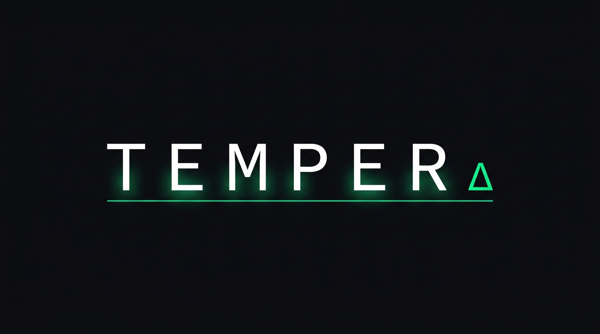
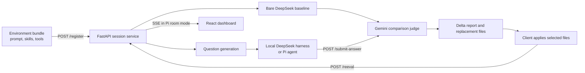

# TEMPER

<p align="center">
  
</p>

TEMPER is a prototype evaluator for AI harnesses. It compares a model with and without its system prompt, skills, and tool definitions, then produces replacement artifacts for regressions and re-runs the affected checks.

**Status:** The deterministic offline evaluation, patch, re-evaluation, schema validation, dashboard build, and room API have been verified. The live model path, hosted deployment, and Pi runtime integration are not currently verified.

**Strongest evidence:** `make test-integration` exercises the FastAPI server and local client across 12 initial questions, writes three patch artifacts, re-evaluates four dimensions with eight questions, and checks the expected scripted outcomes. These scores are fixture data, not benchmark or production results.

```bash
python3 -m venv local/.venv
local/.venv/bin/python -m pip install -r local/requirements.txt
python3 -m venv cloud/.venv
cloud/.venv/bin/python -m pip install -r cloud/requirements.txt
make test-integration
make demo
```

## What it implements

The local path collects `system_prompt.md`, `skills/*.md`, and `tools/*.json` into a validated bundle. The cloud service generates questions, runs a bare DeepSeek baseline, receives answers from the harness-under-test, and uses Gemini to score answer pairs. A negative delta means the harness-scoped answer scored below the bare-model answer on the same question.

TEMPER can return complete replacement files for failing dimensions. The local client or Pi extension applies those files, requests a dimension-scoped re-evaluation, and renders the before and after scores.

The repository contains two clients:

- Python scripts for collecting a directory, running DeepSeek with the collected context, applying patches, and rendering terminal reports.
- A Pi extension and React dashboard for room creation, agent-driven question answering, and per-question updates over server-sent events.

## Architecture


```mermaid
flowchart LR
    B["Environment bundle<br/>prompt, skills, tools"] -->|"POST /register"| S["FastAPI session service"]
    S --> Q["Question generation"]
    S --> D["Bare DeepSeek baseline"]
    Q --> C["Local DeepSeek harness<br/>or Pi agent"]
    D --> J["Gemini comparison judge"]
    C -->|"POST /submit-answer"| J
    J --> R["Delta report and replacement files"]
    R --> P["Client applies selected files"]
    P -->|"POST /reeval"| S
    S -->|"SSE in Pi room mode"| UI["React dashboard"]
```

The core protocol uses outbound HTTP polling. Only the dashboard uses server-sent events. Sessions and room credentials are stored in process memory.

## Technical highlights

- Compares bare and harness-scoped answers to separate model behavior from surrounding instructions in the local DeepSeek path.
- Uses six result dimensions: instruction adherence, tool accuracy, output format, skill triggering, latency delta, and error recovery.
- Validates collected bundles and sample reports against Draft 7 JSON Schemas.
- Supports deterministic offline execution with no model API keys.
- Uses one-time Pi join tokens, separate dashboard keys, and resumable room snapshots.
- Includes a secondary `two_sum` coding check with five deterministic subprocess tests.

## Quick start

### Prerequisites

- Git
- Python 3.12 or newer. Dependency installation was verified with Python 3.12 and 3.14.
- GNU Make for the convenience commands
- Node.js 18, or Node.js 20 or newer, only for rebuilding the dashboard

The repository's `make install-local` and `make install-cloud` targets invoke `python`, which is not available on every system. The explicit `python3` setup below is more portable on macOS and Linux.

```bash
git clone https://github.com/aadityad12/Temper.git
cd Temper

python3 -m venv local/.venv
local/.venv/bin/python -m pip install -r local/requirements.txt

python3 -m venv cloud/.venv
cloud/.venv/bin/python -m pip install -r cloud/requirements.txt
```

Render the committed sample reports without starting a server:

```bash
make demo
```

Run the deterministic client/server integration path:

```bash
make validate-schemas
make test-integration
```

`make test-integration`, `make test-local`, and `make test-cloud` restore `fixtures/villain_env/` with `git checkout`. Do not run them while you have uncommitted changes in that directory.

### Run the dashboard and offline cloud service

```bash
npm --prefix extension/ui ci
npm --prefix extension/ui run build
CLOUD_OFFLINE=true cloud/.venv/bin/python cloud/main.py
```

Open <http://localhost:8001>. The service uses scripted questions, scores, and patches in `CLOUD_OFFLINE=true` mode.

### Run with model APIs

Copy the example configuration and set real credentials:

```bash
cp .env.example .env
```

Set `DEEPSEEK_API_KEY`, `GEMINI_API_KEY`, and explicit model IDs in `.env`, then start the service:

```bash
cloud/.venv/bin/python cloud/main.py
```

In a second terminal:

```bash
TEMPER_OFFLINE=false \
ANTIGRAVITY_BASE_URL=http://localhost:8001 \
local/.venv/bin/python local/eval.py fixtures/villain_env

TEMPER_OFFLINE=false \
ANTIGRAVITY_BASE_URL=http://localhost:8001 \
local/.venv/bin/python local/patch.py fixtures/villain_env
```

The live path makes external API calls that may incur provider charges and has the limitations listed below. It was not executed during the current documentation verification.

## Configuration

Both Python layers load the root `.env` file when present.

| Variable | Used by | Default when unset | Purpose |
|---|---|---|---|
| `DEEPSEEK_API_KEY` | local and cloud | empty | DeepSeek inference credential for live mode |
| `GEMINI_API_KEY` | cloud | empty | Gemini question, judge, and patch credential for live mode |
| `DEEPSEEK_MODEL` | local and cloud | differs by module | Model ID. Set this explicitly so both paths use the same model. |
| `GEMINI_MODEL` | cloud | `gemini-3.5-flash` | Configured Gemini model ID |
| `ANTIGRAVITY_BASE_URL` | local | `http://localhost:8000` | Cloud or mock service base URL |
| `TEMPER_OFFLINE` | local | `false` | When `true`, forces the local client to the mock service on port 8000 and uses a canned harness answer. |
| `CLOUD_OFFLINE` | cloud | `false` | When `true`, uses scripted questions, baseline answers, scores, and patches. |
| `CLOUD_PORT` | cloud | `8001` | Local service port. `PORT` is also accepted as a deployment fallback. |
| `TEMPER_HOST_URL` | cloud | `http://localhost:{PORT}` | Public base URL embedded in Pi connection blocks. |

Never commit `.env`. It is ignored by the repository.

## Validation

| Command | What it verifies |
|---|---|
| `make demo` | The committed pre-evaluation and re-evaluation reports render with Rich. |
| `make validate-schemas` | `fixtures/sample_bundle.json` and `fixtures/sample_eval_report.json` validate against their schemas. |
| `make test-integration` | The offline FastAPI pipeline, local client loop, patch writing, re-evaluation, and score-band assertions. |
| `npm --prefix extension/ui ci && npm --prefix extension/ui run build` | Reproducible dashboard dependency installation and production bundle generation into `cloud/ui_dist/`. |

There is no configured linter, CI workflow, Python unit-test suite, or UI test suite.

## Deterministic fixture output

The committed demo and offline cloud mode use a deliberately flawed customer-support fixture. The initial cloud-offline run serves two scripted questions for each of six dimensions. The scores below are constants in `cloud/judge.py`; they are not observations from live model calls.

| Dimension | Bare baseline | Harness | Delta | Scripted status |
|---|---:|---:|---:|---|
| Instruction adherence | 71 | 44 | -27 | `NEEDS_PATCH` |
| Tool accuracy | 72 | 31 | -41 | `NEEDS_PATCH` |
| Output format | 88 | 85 | -3 | `PASSING` |
| Skill trigger | 60 | 52 | -8 | `NEEDS_PATCH` |
| Latency delta | 90 | 74 | -16 | `NEEDS_PATCH` |
| Error recovery | 38 | 35 | -3 | `STRUCTURAL_LIMITATION` |

The offline re-evaluation uses another fixed score bank. The integration test asserts movements of at least 30 points for instruction adherence and tool accuracy. It demonstrates protocol correctness and deterministic regression coverage, not remediation effectiveness on independent data.

## Design decisions and tradeoffs

- The local comparison uses the same configured DeepSeek model for bare and harness runs. This controls one major variable, but Gemini-based scoring can still vary in live mode.
- Pi room mode compares a Pi agent against a DeepSeek baseline, so its delta also includes model differences. It should not be interpreted as a harness-only effect.
- Patch responses contain full replacement files. This keeps the write path simple, but it can overwrite local content and does not provide merge conflict handling.
- Polling keeps the client protocol simple and works behind NAT. SSE is reserved for browser updates.
- In-memory sessions simplify the prototype, but do not survive restarts and do not support horizontal workers.

## Current limitations

- `latency_delta` converts mean inference times to a simple `100 - floor(milliseconds / 20)` score. It falls back to scripted values when either side has no timing data, and it is not a general performance benchmark.
- `error_recovery` is always classified as `STRUCTURAL_LIMITATION`; it is not inferred from general evidence.
- Live question and patch failures can fall back to scripted questions or canned Acme fixture patches. Canned live-mode patches are marked with `is_fallback: true`; treat the logs and returned artifacts as required review points.
- `/register` rejects empty or malformed legacy bundles, but `/results` still does not return the full shape required by `schemas/eval_report.schema.json`.
- Generated patch filenames are written directly under the target directory without path containment checks. Review every patch before applying it to untrusted input.
- Rooms and sessions have no persistence or expiry. Dashboard credentials are placed in query strings.
- A clean `npm audit` reports six advisories in the locked dashboard dependency tree: three high and three moderate. Update and review dependencies before exposing the development server.
- The previously documented hosted deployment could not be resolved during verification and is not presented as an active demo.

## Repository map

```text
local/             Python collector, client, DeepSeek harness, patcher, renderer, and tests
cloud/             FastAPI service, Gemini and DeepSeek integrations, session store, and built UI
extension/         Pi extension, protocol skill, and React dashboard source
fixtures/          Sample bundles, reports, seeded harness, and coding fixture
schemas/           Bundle and full-report JSON Schemas
contract/api.md    Implemented HTTP and SSE interface
EVAL_GUIDE.md      Local evaluation and patch workflow
TEMPER_spec.md     Design rationale and evaluation semantics
```

## Contributors and license

Commit history records the following project contributions:

- [Aaditya Desai](https://github.com/aadityad12): schemas and contracts, local and cloud evaluation paths, Pi protocol and patch workflow, integration tests, and documentation.
- [Sheel Shah](https://github.com/shahxsheel): initial repository setup, multi-session room service, live dashboard, deployment configuration, and coding benchmark.
- [Oak Soe Khant](https://github.com/Mr-Shine09): TEMPER visual identity and repository logo.

See the commit history for file-level ownership. TEMPER was originally developed for the AI Engineer World's Fair Hackathon 2026.

No license file is present. The repository does not currently grant an open-source license.
